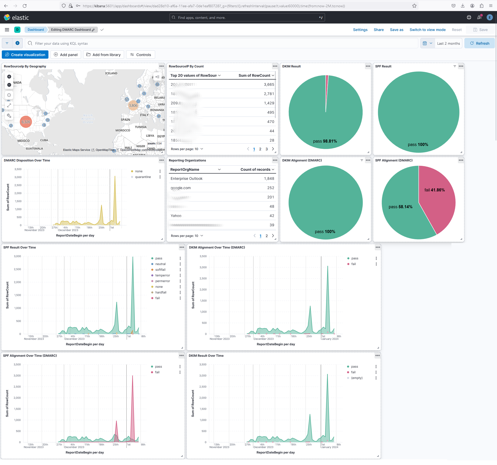

# Introduction

This project is explained by these videos:

1. Demonstration: https://www.youtube.com/watch?v=XLTaKeJhI7c
2. Explanation: TBD
3. SPF/DKIM/DMARC Tutorial: TBD

# Installation

Assume the `~/` reflects your project directory, meaning the same directory as the file `docker-compose.yml`.  So if your `docker-compose.yml` is in `/home/stephanie/dmarc/docker-compose.yml`, then all mentions of `~/` in the instructions below will mean `/home/stephanie/dmarc/`.

## Start ELK
1. Make a copy of `~/env.sample` to `~/.env`.  Optional - customize settings for better security.
2. Type `cd ~/` to return to project directory.
3. Type `docker-compose up --build -d` to start up the ELK project.
4. Login with `elastic` and the password found in the `~/.env` file to ensure the entire ELK stack is up and running.
5. Open your web browser and go to `https://<ip address or hostname of kibana>:5601`.
6. Accept any security warnings about untrusted SSL certificates.

## Ingest Data
7. Make a copy of `~/parser/env.sample` to `~/parser/.env`.  Optional - customize settings for better security.
8. Put all your zipped DMARC aggregation reports into the `~/parser/logs/zipped/`.  Sample DMARC aggregration reports can be copied from `~/parser/logs/zipped-sample/`.  The zipped DMARC reports should end with any of the following filename extensions: `*.gz` or `*.zip`.
9. Type `docker exec -it dmarc-parser-1 ./start.sh` to extract, transform and load DMARC aggregation data into your ELK stack.
10. Go to your web browser in Kibana and go to Dashboards to see your DMARC Dashboard.

